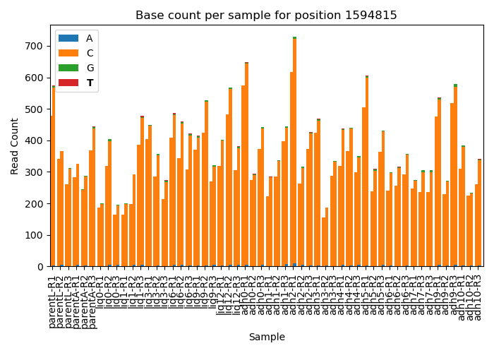

## *Prochlorococcus* Biofilm Dynamics: Taxonomic Classification and Variant Calling  
Repository for pipelines, scripts, and figures for variant calling and taxonomic classification analyses in the publication: 
1. Anjur-Dietrich, M.I., Jones, K.J., Mullet, J.I., Vo, N.N., Castro, K.G., Parker, S.M,, Chisholm, S.W. (2025). Biofilm formation and dynamics in the marine cyanobacterium Prochlorococcus. [bioRxiv](https://doi.org/10.1101/2025.08.05.668435).  

## Microbial Abundance Analysis
All codes for microbial abundance analysis are located in `TaxonomicClassification/`.
- Raw reads are processed through a modified version of [ProSynTax-workflow](https://github.com/jamesm224/ProSynTax-workflow/tree/main) to obtain classification.    
    - Modified version of ProSynTax located in `TaxonomicClassification/Modified-ProSynTax-Workflow/`.  
- Scripts in `TaxonomicClassification/StandardizeData/` were used to perform limit of detection filtering and format data for plotting.  
- Scripts in `TaxonomicClassification/Plots/` were used to generate figures. 
- Quantitative (absolute) read counts were obtained using scripts in `TaxonomicClassification/AbsoluteGenomeEquivalents/`.  

**Figure 6:** 

### Modified ProSynTax Workflow  
The [ProSynTax-workflow](https://github.com/jamesm224/ProSynTax-workflow/tree/main) was modified to include downloading SRA samples from NCBI, quantification of Thermus internal standards added, removal of standards before classification.

Snakemake rules added:  
- `SRA_download`: downloads SRA file from NCBI.  
- `run_trim_PE_local` and `run_trim_PE_sra`: edited `run_trim_PE` to process both local files and files downloaded from NCBI SRA.  
- `index_genome`: index reference Thermus genome.  
- `obtain_thermus_reads`: map reads to Thermus genome and obtain names of reads mapped.  
- `remove_thermus_reads`: remove Thermus reads from read pool before taxonomic classification. 

## Variant Calling Analysis  
All codes for variant calling analysis are located in `VariantCalling/`.  
- Raw reads are processed through a modified version of [WideVariant](https://github.com/liebermanlab/WideVariant) workflow developed by the Lieberman lab to obtain variants.  
    - Modified workflow located in `VariantCalling/Modified-WideVariant-Pipeline/`
- Scripts in remaining subfolders folder were used to generate data and figures for publication.   

**Variant position across samples:**  

  
  

  

### Modified WideVariant Workflow  
The [WideVariant](https://github.com/liebermanlab/WideVariant) workflow was modified to decrease filtering thresholds: 
- minimum allele frequency threshold decreased to 0.1
- maximum read depth per position increased to 5000

Conda environments in `envs/*.yaml` files were adjusted to enable compatibility with our system. 